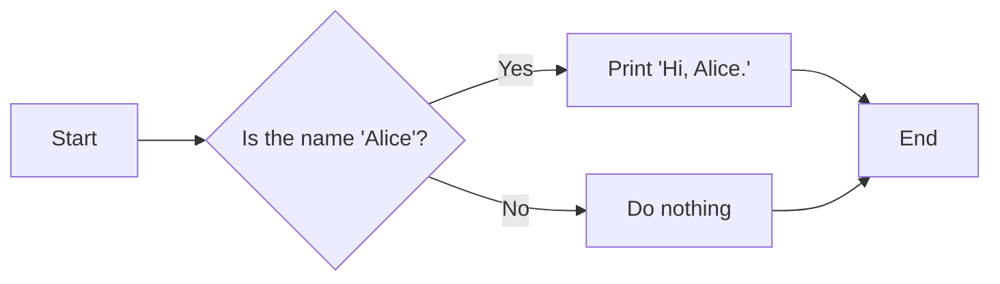
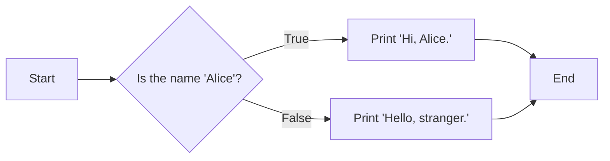
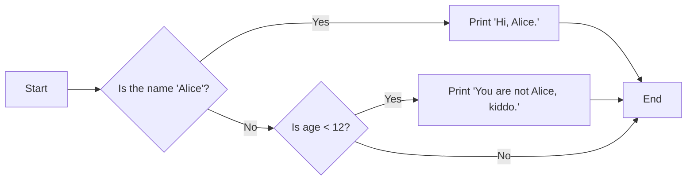

# Basic Syntax

### Variables
### Nameing
A good variable name describes the data it contains.
three rules:
1. It can be only one word with no spaces.
2. It can use only letters, numbers, and the underscore (_) character.
3. It can’t begin with a number.

### Flow Control Statements
### if statement consists of the following:
- The if keyword
- A condition (that is, an expression that evaluates to True or False)
- A colon
- Starting on the next line, an indented block of code (called the if clause)

```python
if name == 'Alice':
    print('Hi, Alice.')
```

### else Statements
The else clause is executed only when the if
statement’s condition is False.

An **else statement** always consists of the following:
- The else keyword
- A colon
- Starting on the next line, an indented block of code (called the else clause)
```python
if name == 'Alice':
print('Hi, Alice.')
else:
print('Hello, stranger.')
```


### elif Statements
The elif statement is an “else if” statement that always follows an if or another
elif statement. It provides another condition that is checked only if all of the previous conditions were False .

In code, an elif statement always consists of the following:
- The elif keyword
- A condition (that is, an expression that evaluates to True or False)
- A colon
Starting on the next line, an indented block of code (called the elif clause)
```python
if name == 'Alice':
print('Hi, Alice.')
elif age < 12:
print('You are not Alice, kiddo.')
```

First, there is always exactly one if statement. Any elif statements you need should follow the if statement.
Second, if you want to be sure that at least one clause is executed, close the structure with an else statement.

### while Loop Statements
The code in a while clause will be executed as long as the while statement’s condition is True. 

In code, a while statement always consists of the following:
- The while keyword
- A condition (that is, an expression that evaluates to True or False)
- A colon
- Starting on the next line, an indented block of code (called the while clause)

In the while loop, the condition is always checked at the start of each iteration (that is, each time the loop is
executed). If the condition is True, then the clause is executed, and afterward, the condition is checked again.
The first time the condition is found to be False, the while clause is skipped.

**break Statements**
There is a shortcut to getting the program execution to break out of a while loop’s clause early. If the
execution reaches a break statement, it immediately exits the while loop’s clause. In code, a break statement
simply contains the break keyword.

**continue Statements**
Like break statements, continue statements are used inside loops. When the program execution reaches a
continue statement, the program execution immediately jumps back to the start of the loop and reevaluates
the loop’s condition. 

### for Loops and the range() Function
In code, a for statement looks something like for i in range(5): and includes the following:
- The for keyword
- A variable name
- The in keyword
- A call to the range() method with up to three integers passed to it
- A colon
- Starting on the next line, an indented block of code (called the for clause)

```python
print('My name is')
for i in range(5):
    print('Jimmy Five Times (' + str(i) + ')')

#output
immy Five Times (0)
Jimmy Five Times (1)
Jimmy Five Times (2)
Jimmy Five Times (3)
Jimmy Five Times (4)
```
The range() function can also be called with three arguments. The first argument will be where the for loop’s variable starts, and the second argument will be up to, but
not including, the number to stop at and the third will be the step argument. The step is the amount that the variable is increased
by after each iteration.

    for i in range(0, 10, 2):  #ie (start,end,step)
    print(i)
    #So calling range(0, 10, 2) will count from zero to eight by intervals of two.
    #result    
    0
    2
    4
    6
    8

#### Example 

```python
import random
import sys

print('ROCK, PAPER, SCISSORS')

# These variables keep track of the number of wins, losses, and ties.
wins = 0
losses = 0
ties = 0

while True:  # The main game loop.
    print(f'{wins} Wins, {losses} Losses, {ties} Ties')

    while True:  # The player input loop.
        print('Enter your move: (r)ock (p)aper (s)cissors or (q)uit')
        playerMove = input()

        if playerMove == 'q':
            sys.exit()  # Quit the program.

        if playerMove in ['r', 'p', 's']:
            break  # Break out of the player input loop.

        print('Type one of r, p, s, or q.')

    # Display what the player chose:
    if playerMove == 'r':
        print('ROCK versus...')
    elif playerMove == 'p':
        print('PAPER versus...')
    elif playerMove == 's':
        print('SCISSORS versus...')

    # Display what the computer chose:
    randomNumber = random.randint(1, 3)

    if randomNumber == 1:
        computerMove = 'r'
        print('ROCK')
    elif randomNumber == 2:
        computerMove = 'p'
        print('PAPER')
    elif randomNumber == 3:
        computerMove = 's'
        print('SCISSORS')

    # Display and record the win/loss/tie:
    if playerMove == computerMove:
        print('It is a tie!')
        ties += 1
    elif (playerMove == 'r' and computerMove == 's') or \
            (playerMove == 'p' and computerMove == 'r') or \
            (playerMove == 's' and computerMove == 'p'):
        print('You win!')
        wins += 1
    else:
        print('You lose!')
        losses += 1

```
